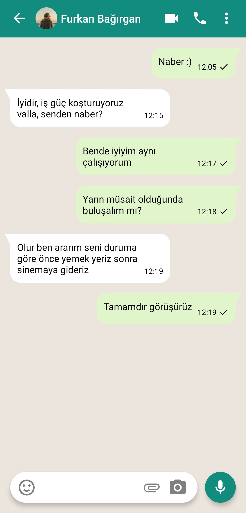

# Assignment-2
In this application, the home screen and chat screen of the Whatsapp was created using mock data.

## Used technologies
- React Native CLI
- React Native Navigation
- React Native Vector Icons

## Screens
<div>
<kbd></kbd>
<kbd></kbd>
</div>

## Installation
1.Clone Project
```
git clone https://github.com/furkanbagirgan/Whatsapp-Chatscreen-App.git
```
2.Install the Necessary Packages for Project
```
npm install
```
3.Run Project To Emulator or Real Device
```
npx react-native start & npx react-native run-android
```
